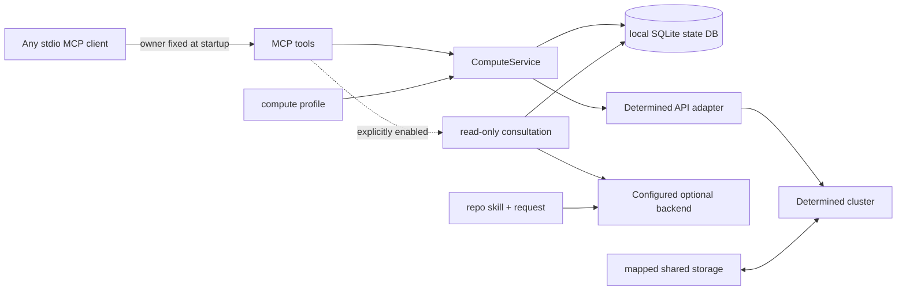

# Compute service guide

## Architecture

The service separates deterministic task control from optional agent advice:



`ComputeService` is the source of truth for task planning, idempotent launch, discovery/adoption, ownership checks, status, logs, cancellation, and conservative reconciliation. Its local `task_id` is stable across service restarts and is separate from any Determined `remote_id`. The SQLite file belongs on local durable storage; code, data, packages, checkpoints, logs, and outputs belong on mapped shared storage.

The MCP server is a local stdio service for one trusted user. It binds `owner` when the process starts, so tools cannot claim another namespace. Separate sessions can use separate owner names against one database; deliberate collaboration can share a name. This boundary helps organize tasks but does not provide multi-user security. An exposed or remote service needs a separate transport and authentication design.

The standard workflow is client and model independent: the caller plans with its own agent and invokes deterministic tools. Consultation is disabled by default. An operator can enable the optional Codex backend with a chosen model; its read-only worker receives the request and repository skill and persists its workflow state. Its advice does not launch or cancel work. See [consultation setup](agent-workflow.md).

## Profile

Load a profile with `ComputeProfile.from_file(path)`. The schema is:

```yaml
cluster_identity: optional-deployment-label
mounts:
  - host_path: /shared/path/on/agents
    container_path: /path/inside/container
  - host_path: /shared/reference/data
    container_path: /reference/data
    read_only: true
defaults:
  image: verified-image
  pool: verified-pool
  slots: 1
shell_inactivity_seconds: 7200
```

Shared roots can include `/SSD`, `/SSD_home`, `/SSD_datasets`, `/SSD3`, `/SSD3_home`, `/SSD3_datasets`, and `/UNSAFE_SSD4`. Declare each available root in `mounts`; host paths refer to cluster agents and need not exist on the machine running the MCP client. The example profile maps these roots to the same container paths. Remove roots unavailable on your deployment.

Mount mappings are required. A mount may set `read_only: true`; the generated Determined bind mount preserves that restriction. `workdir` and `output_dir` must resolve under writable mounts. Uploads and explicit checkpoint targets must also be writable; reading or fetching reference data remains allowed. Host-path aliases use the most-specific configured host root, with read-only taking precedence for equal matches. This is a service policy, not a replacement for filesystem permissions. Omitting `read_only` keeps the existing writable default. Image, pool, and slot values are deployment defaults and can be overridden by a request. `shell_inactivity_seconds` is optional and has no service default. The value is advisory; the service does not enforce shell idle timeouts.

## Request and mode selection

A request can contain:

| Field | Type | Purpose |
| --- | --- | --- |
| `name`, `description` | string | Client-chosen display name and task purpose |
| `allow_queue` | boolean | Explicitly permit queuing; defaults to false |
| `kind` | `auto`, `command`, `shell`, `experiment` | Requested execution mode |
| `interactive` | boolean | Makes auto mode choose `shell` |
| `overnight` | boolean | Makes auto mode choose `experiment` |
| `command` | string or string list | Workload command |
| `workdir` | absolute container path | Working directory under a configured mount |
| `output_dir` | absolute container path | Output directory under a configured mount |
| `slots` | non-negative integer | Requested resource slots; zero is CPU-only if supported by the pool |
| `pool`, `image` | string | Optional profile-default overrides |
| `code_revision` | string | Revision/content identifier |
| `experiment_config` | object | Experiment-specific options |

Auto mode selects `shell` for interactive requests, `experiment` for overnight requests or those carrying `experiment_config`, and `command` otherwise. An explicit `kind` is preserved; for example, an overnight command remains a command and receives an experiment advisory. Use `command` for a one-off job expected to finish in a working session, `shell` for iterative debugging, and `experiment` for durable/overnight work or actual experiment features such as search, trial tracking, and checkpoint lifecycle.

`plan(request)` is offline and non-mutating. It returns the resolved `kind`, rendered `config`, `code_revision`, and `advisories`. Command and shell configs use `resources.slots`; experiments use `resources.slots_per_trial`. Planning must reject paths outside configured container mounts and source-upload fields. It does not authenticate, query the cluster, create projects, or launch work.

New launches check current capacity in the requested pool unless `allow_queue: true` is explicit. GPU/CPU slot requests use schedulable agent slots; zero-slot tasks use auxiliary-container capacity. Insufficient or unknown capacity is reported before submission. `compute_resources(slots, pool)` and `determined-compute resources --slots N --pool POOL` expose the same live inventory. Alternative pools are suggestions, not automatic substitutions; capacity checks are snapshots, not reservations.

Names and descriptions are provided by the MCP client. Commands and shells show the name on the first line of their description; experiments use their native name field. The internal submission marker is kept in a reserved environment variable and does not replace user-visible text.

## Determined adapter behavior

The adapter exposes one `launch_task(kind, config)` boundary. Command and shell launches send the generated config mapping. Experiment launches serialize that config as YAML and request activation. The adapter rejects upload aliases including file contexts, project roots, and model definitions before transport; it never creates a project automatically. Responses are normalized to an entity with an `id`, with API envelopes removed. Configuration retained for identity reconciliation is sanitized: credential-like fields and environment-variable collections are redacted.

Command and shell cancellation use their task kill endpoint; experiment cancellation uses the experiment cancel endpoint. Command and shell logs come from the task log API. Experiment logs come from the highest numeric trial ID when trials exist. All log lists are returned oldest-to-newest for reading even though the API query asks for the latest records.

## Shared-storage preparation

Submissions carry path references only. Never populate an experiment `modelDefinition`, send a project archive, or use a project-root upload option. Place the complete runtime closure on mapped storage: source, configuration, data, locally supplied packages, checkpoints, logs, and expected artifacts.

Use a revision-specific directory for unattended work, for example:

```text
/workspace/<user>/compute/runs/<project>/<revision>/
  repo/
  results/
  checkpoints/
```

Set `workdir` and `output_dir` to the corresponding container paths and record `code_revision`. A mutable `/compute/debug/<project>` tree is appropriate for a shell. If directly syncing files, omit `--delete` and exclude `.env*`, `.secrets*`, credentials, tokens, caches, and project-specific secret files. The skill's [workflow reference](../skills/intensive-compute-runner/references/compute-workflow.md) contains a conservative template.

## MCP operation

Start a server with:

```bash
determined-compute-mcp \
  --profile /absolute/path/to/compute-profile.yaml \
  --db /absolute/local/path/to/compute.sqlite3 \
  --owner "$USER" \
  --repo-root /absolute/path/to/this/repository
```

Equivalent environment variables are `DETERMINED_COMPUTE_PROFILE`, `DETERMINED_COMPUTE_DB`, `DETERMINED_COMPUTE_OWNER`, and `DETERMINED_COMPUTE_REPO_ROOT`. The profile and database paths remain required in practice; keep credentials in the established Determined provider rather than these files.

After upgrading the service, restart every MCP process that shares the SQLite database so each process loads the new tools and additive database schema.

The tools are:

| Tool | Arguments | Result |
| --- | --- | --- |
| `compute_resources` | optional `slots=1`, `pool` | Current scheduling capacity and candidate pools |
| `storage_check` | `path` | Check a shared path locally or through the login node |
| `storage_sync` | `local_dir`, `shared_dir`, optional `dry_run=true` | Preview or copy local files to shared storage |
| `storage_fetch` | `shared_dir`, `local_dir`, optional `dry_run=true` | Preview or copy shared files locally |
| `compute_plan` | `request` | Core plan object |
| `compute_launch` | `request`, `request_id` | Persisted task object |
| `compute_status` | `task_id` | Refreshed task object |
| `compute_logs` | `task_id`, optional `tail=200` | Core log result |
| `compute_cancel` | `task_id` | Updated task object |
| `compute_reconcile` | `task_id`, `remote_id` | Safely bind a verified uncertain submission |
| `compute_discover` | `kind`, optional `limit=50`, `offset=0` | List current-account remote tasks without registering them |
| `compute_adopt` | `kind`, `remote_id` | Register an existing current-account remote task locally |
| `compute_list_tasks` | none | Tasks in the startup-bound owner namespace |
| `compute_consult` (optional) | `question`, `request_id`, optional `context` | Persisted workflow object |
| `workflow_status` (optional) | `workflow_id` | Current persisted workflow object |

`compute_consult` and `workflow_status` are advertised only when a consultation backend is enabled. Standard compute and storage tools do not need a Codex installation, a consultation model or the repository skill files.

Launch requests may include an optional single-line `name`. Commands and shells use it
as their Determined display description; experiments use it as the native experiment
name. Top-level `name` and `description` override experiment-native metadata when supplied; otherwise the native values are retained. Display metadata is stored in SQLite and must not contain credentials.

The owner is never a tool argument. On failure, MCP raises a tool error (`isError: true`) whose compact JSON content has the shape `{"error":{"code":"...","message":"...","retryable":false,"details":{...}}}`; `retryable` and `details` appear when available, and `structured_content` is null. Uncertain submission errors include their local task ID in details. Plan first, review resolved paths and advisories, and then launch with a stable request ID. Reusing that ID with identical content returns the established record; conflicting content is rejected.

For a running shell, use the adapter's sanitized `reconnectCommand`, currently `det shell show_ssh_command <remote-id>`. The adapter removes `privateKey` from returned shell entities; do not copy private key material into task records, MCP context, or reports.

## Discover and adopt existing remote tasks

`compute_discover(kind, limit=50, offset=0)` performs a read-only, paginated query for tasks owned by the currently authenticated Determined account. `kind` is required and must be `command`, `shell`, or `experiment`; `limit` must be 1–100. Discovery neither writes a local task record nor submits a remote task.

Use discovery for tasks created through the Determined WebUI, native CLI, or another device using the same account. The CLI equivalent is:

```bash
determined-compute ... discover command --limit 20 --offset 0
```

`compute_adopt(kind, remote_id)` registers one discovered remote task in the startup-bound owner namespace. Before writing, the service reads the current `/me` user ID and `/info` cluster ID, fetches the remote task, and requires its `userId` to match the current account. An administrator cannot use adoption to claim another user's task. Remote authorization for later status, logs, and cancellation remains the authorization of the configured Determined account.

A newly adopted local record exposes `origin: "adopted"` and stores only safe identity/status metadata, including the available name and description. It does not persist raw remote configuration or credentials. If `workdir`, `output_dir`, or `code_revision` cannot be established safely, those fields remain empty rather than being inferred. Adoption grants no additional shared-storage access.

Adoption is keyed by local owner, actual cluster ID, task kind, and remote ID. Repeating the same adoption returns the existing local `task_id`. A different local SQLite database registers the task independently; keep databases on local durable disk rather than shared NFS. Adopted records bind to the actual cluster and account identity, not to the launch profile. Existing locally launched records retain their original profile binding.

After adoption, use the returned local ID with `compute_status`, `compute_logs`, or `compute_cancel`. Adoption does not accept an old `request_id` and never launches the remote task again. Its CLI equivalent is:

```bash
determined-compute ... adopt command REMOTE_ID
```

`compute_reconcile` is not an adoption shortcut. Reconciliation repairs an existing local submission whose remote acceptance was uncertain and requires its submission marker to match. If an uncertain local submission already exists, use its local `task_id` with `compute_reconcile` instead of registering the remote task again. Use `compute_adopt` for an independently created remote task.

## Failure and recovery rules

Transport, authentication, permission, and response-shape failures are errors, not empty results. Authentication failure never causes local fallback. Task log calls request the newest records from Determined and return them in chronological order; an experiment with no trials returns an empty list.

A network timeout during submission can leave acceptance uncertain. The service records that state and does not automatically resubmit, including after restart. MCP exposes `compute_reconcile(task_id, remote_id)` and the CLI exposes `determined-compute ... reconcile TASK_ID REMOTE_ID`. The core fetches that remote entity and binds it only when its unguessable submission marker matches the reserved `COMPUTE_SUBMISSION_MARKER` environment value; a mismatch fails with `identity_mismatch`. The API exposes only that validated marker while redacting other environment values. First-line description markers are supported only for migrated legacy records without stored display metadata. Without verified evidence, investigate before any new launch.

Remote termination does not by itself prove success. Check exit information and the requested shared-storage artifacts or metrics before reporting completion. Reports may include sanitized commands, paths, task IDs, remote IDs, states, and errors; they must omit credential values and secret-file contents.

For consultation worker setup and crash recovery, see [agent-workflow.md](agent-workflow.md).

For local mounts, SSH agents, passwords, keyrings and connection reuse, see [shared-storage-access.md](shared-storage-access.md).

An explicitly supplied `checkpoint_storage` must use `type: shared_fs` under writable profile roots. Its effective `storage_path` must remain inside `host_path`; legacy `checkpoint_path` and `tensorboard_path` aliases are rejected. If checkpoint storage is omitted, Determined uses its cluster default; the service cannot inspect that default during offline planning.
