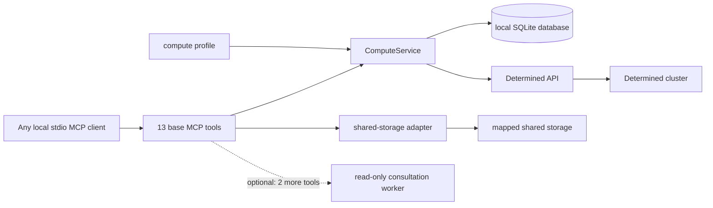

# Compute service reference

[English](compute-service.md) | [简体中文](compute-service.zh.md)

This document describes the configuration and public MCP interface of the local
Determined compute service. For an agent-neutral sequence for preparing, launching,
and checking work, see [Agent workflow](agent-workflow.md). For the optional
server-side advice worker, see [Consultation backend](consultation.md).

## Architecture and trust boundary



The MCP server is a local stdio service for one trusted user. It binds `owner` at
startup; no tool accepts an owner argument. Separate processes can use separate owner
names with one database, while collaborators can deliberately share a name. This is a
namespace boundary, not multi-user authentication. A remotely exposed service needs
its own authenticated transport.

`ComputeService` owns planning, idempotent submission, status, logs, cancellation,
discovery, adoption, and conservative reconciliation. Its local `task_id` remains
stable across restarts and is distinct from the Determined `remote_id`. Keep the SQLite
database on durable local storage. Keep source, data, packages, checkpoints, logs, and
outputs on mapped shared storage.

The default consultation backend is `none`. That mode registers 13 base tools and does
not import the consultation worker, require Codex, or require a repository skill
directory. Enabling the Codex backend adds `compute_consult` and `workflow_status`, for
15 tools in total. Consultation is advisory and cannot submit or cancel work.

## Compute profile

Pass the profile with `--profile PATH` or `DETERMINED_COMPUTE_PROFILE`. Its schema is:

```yaml
cluster_identity: optional-deployment-label
mounts:
  - host_path: /shared/projects
    container_path: /workspace
  - host_path: /shared/reference
    container_path: /reference
    read_only: true
defaults:
  image: your-image
  pool: your-pool
  slots: 1
shell_inactivity_seconds: 7200
```

At least one mount is required. `host_path` is the path on cluster agents and need not
exist on the MCP client machine. Requests use `container_path`; container roots cannot
overlap, so each container path maps through one corresponding mount. When validating
a host-path alias against overlapping host roots, the most specific root controls and
read-only wins a tie. `workdir`, `output_dir`, and explicit checkpoint targets must be
under writable mounts; reading reference data under a read-only mount remains valid.
These checks are service policy and do not replace filesystem permissions.

The image, resource pool, and slot count are defaults that a request can override.
`slots` must be a non-negative integer; zero asks for CPU-only auxiliary capacity when
the pool supports it. `shell_inactivity_seconds` is optional and advisory. The service
does not enforce an idle timeout.

`cluster_identity` is an optional operator-facing label. Submitted local records bind
to the profile fingerprint and the resolved Determined endpoint, including this label.
Changing that binding prevents later status, log, cancellation, and reconciliation
operations on those records.

## Request object and planning

`compute_plan` and `compute_launch` accept the same request object:

| Field | Type | Meaning |
| --- | --- | --- |
| `name` | string | Optional display name, at most 128 characters |
| `description` | string or null | Optional display description, at most 2,048 characters |
| `allow_queue` | boolean | Allow submission when current capacity is insufficient; default `false` |
| `kind` | `auto`, `command`, `shell`, or `experiment` | Execution mode; default `auto` |
| `interactive` | boolean | Requires shell mode; in auto mode selects `shell` |
| `overnight` | boolean | In auto mode selects `experiment` |
| `command` | string or string array | Command or experiment entrypoint; shell mode rejects it |
| `workdir` | absolute container path | Working directory under a writable configured mount |
| `output_dir` | absolute container path | Output directory under a writable configured mount |
| `slots` | non-negative integer | Requested slots; defaults to the profile value |
| `pool`, `image` | string | Optional overrides of profile defaults |
| `code_revision` | string or null | Caller-provided revision or content identifier |
| `experiment_config` | object | Extra experiment configuration; requires experiment mode |

Unknown request fields and upload/context fields are rejected. In auto mode,
`interactive` selects `shell`, then `overnight` or `experiment_config` selects
`experiment`, and all other requests select `command`. An explicit `kind` is retained;
an overnight command therefore stays a command and receives an advisory.

Planning is offline and does not authenticate, inspect capacity, create projects, or
submit work. It returns `kind`, `name`, `description`, `allow_queue`, rendered `config`,
`code_revision`, and `advisories`. If `name` is omitted, the service creates one and
adds an advisory. Commands and shells place the name on the first description line;
experiments use their native name field. Top-level display metadata overrides matching
experiment fields.

Command and experiment entrypoints create `output_dir`, change to `workdir`, and then
run the command through `/bin/bash -lc`. Command and shell configs use
`resources.slots`; experiments use `resources.slots_per_trial`. The service supplies
profile bind mounts and manages `COMPUTE_WORKDIR`, `COMPUTE_OUTPUT_DIR`,
`COMPUTE_CODE_REVISION`, and the private submission marker. A request cannot override
those variables or bind mounts.

Experiments require `command` or `experiment_config.entrypoint`, but not both. An
explicit `checkpoint_storage` must have `type: shared_fs`, a writable mapped
`host_path`, and an optional `storage_path` that remains inside that host path. Legacy
`checkpoint_path` and `tensorboard_path` aliases are rejected. If checkpoint storage is
omitted, Determined applies its cluster default, which offline planning cannot inspect.

## Start the MCP server

Start one persistent stdio process per configured client:

```bash
determined-compute-mcp \
  --profile /absolute/path/to/compute-profile.yaml \
  --db /absolute/local/path/to/tasks.sqlite3 \
  --owner your-owner \
  --secrets-file /absolute/path/to/credentials.env \
  --verify-ssl
```

`--profile`, `--db`, and `--owner` correspond to
`DETERMINED_COMPUTE_PROFILE`, `DETERMINED_COMPUTE_DB`, and
`DETERMINED_COMPUTE_OWNER`. `--storage-config` corresponds to
`DETERMINED_COMPUTE_STORAGE`; `--secrets-file` can instead be supplied through
`DETERMINED_COMPUTE_SECRETS`. The API URL, token, and TLS verification default to
`DET_MASTER`, `DET_API_TOKEN`, and `DET_VERIFY_SSL`; keep credentials in the existing
provider or secrets file rather than the profile, database, tool arguments, or reports.

The default database path used by the CLI is
`~/.local/state/determined-compute/tasks.sqlite3`, but MCP deployments should specify
an absolute local path. MCP rejects `:memory:`. After an upgrade, restart every MCP
process that shares the database so all processes load the same tool set and additive
schema.

Optional client-side access to mapped storage uses the same profile and a separate
storage configuration. See [Shared-storage access](shared-storage-access.md).

## MCP API

The base server exposes 13 tools. The `owner` below is always the startup-bound
namespace and never a tool argument.

| Tool | Arguments | Return value and effect |
| --- | --- | --- |
| `compute_plan` | `request` | Offline normalized plan; no cluster or database mutation |
| `compute_launch` | `request`, `request_id` | Persisted task record; may submit once |
| `compute_status` | `task_id` | Local task record, refreshed remote state, and remote entity when bound |
| `compute_logs` | `task_id`, optional `tail=200` | Chronological list of the newest remote log records |
| `compute_cancel` | `task_id` | Updated record, remote cancellation response, and acknowledgement |
| `compute_reconcile` | `task_id`, `remote_id` | Record bound only after marker verification |
| `compute_list_tasks` | none | Local records in the bound owner namespace |
| `compute_discover` | `kind`, optional `limit=50`, `offset=0` | One current-account remote page; no local mutation |
| `compute_adopt` | `kind`, `remote_id` | Idempotently registered local record; no remote submission |
| `compute_resources` | optional `slots=1`, `pool` | Current scheduler capacity and candidate pools |
| `storage_check` | `path` | Access information for a mapped container path |
| `storage_sync` | `local_dir`, `shared_dir`, optional `dry_run=true` | Preview or copy local directory contents to shared storage |
| `storage_fetch` | `shared_dir`, `local_dir`, optional `dry_run=true` | Preview or copy shared directory contents locally |

`compute_consult(question, request_id, context?)` and
`workflow_status(workflow_id)` appear only with an enabled consultation backend. Their
configuration, lifecycle, and limits are in [Consultation backend](consultation.md).

### Plan, capacity, and launch

Call `compute_plan` first and review resolved paths, mode, image, pool, slots, and
advisories. `compute_resources` is a live snapshot, not a reservation. Positive slot
requests inspect schedulable agent slots; zero checks auxiliary-container capacity.
Candidate pools are suggestions and are never substituted automatically.

`compute_launch` checks capacity unless `allow_queue` is explicitly true. Its
`request_id` is an idempotency key within the bound owner. Repeating the same ID and
equivalent request returns the established record. Reusing it with different content
returns `idempotency_conflict`. Once a local row has claimed an ID, a retry cannot
submit a second remote task, even after restart.

The adapter sends command and shell configs as mappings. It serializes experiment
configs as YAML and requests activation. It rejects source upload aliases, never
creates a project, removes API envelopes, sanitizes retained identity material, and
returns an entity with an `id`.

### Task records, status, logs, and cancellation

A public task record includes `task_id`, `request_id`, `owner`, `origin`, `kind`, local
`state`, `remote_id`, `remote_state`, display metadata, paths, revision, cluster/account
binding fields, an optional fixed `error_code`, and timestamps. Internal request hashes,
profile hashes, and submission markers are never public. The service stores no full
request body, generated config, API response, logs, or raw exception text in a task
record.

`compute_status` returns local state without contacting Determined when no remote ID is
bound. Otherwise it fetches the entity, updates `remote_state`, and includes the
sanitized entity as `remote`. A stale `pending` or `submitting` row becomes
`submission_uncertain`; this never causes automatic resubmission.

`compute_logs` requires a positive `tail`. Command and shell logs come from their task
log API. Experiment logs come from the highest numeric trial ID; an experiment with no
trials returns an empty list. Results are ordered oldest to newest. A task with no
remote ID also returns an empty list.

`compute_cancel` uses the task kill endpoint for commands and shells and the experiment
cancel endpoint for experiments. It requires a bound remote ID and returns
`cancellation_acknowledged: true` when the API call completes. Remote termination alone
does not prove success; inspect exit information and expected shared-storage artifacts.

For a running shell, use the sanitized `reconnectCommand`, currently
`det shell show_ssh_command <remote-id>`. The adapter removes `privateKey`; never put
private key material in task records, consultation context, or reports.

### Discover and adopt

`compute_discover` accepts `kind` equal to `command`, `shell`, or `experiment`. `limit`
must be 1 through 100 and `offset` must be non-negative. It queries only tasks owned by
the currently authenticated Determined account and returns the actual cluster ID,
account identity, sanitized metadata, any matching `local_task_id`, and consistent
pagination including `next_offset`. It neither writes a local record nor submits work.
Command and shell remote IDs are UUIDs; experiment remote IDs are positive integers.

`compute_adopt` fetches one remote task and verifies both its normalized ID and
`userId` against `/me` before writing. Administrative visibility cannot be used to
adopt another user's task. Registration identity is the local owner, actual cluster ID,
kind, and remote ID; the record also binds and verifies the authenticated user ID. A
previously submitted record in the same database is returned unchanged rather than
replaced.

New adopted records have `origin: "adopted"`, local `state: "adopted"`, and an internal
adoption request ID. They retain only whitelisted identity, state, name, and description
metadata. Unknown `workdir`, `output_dir`, and `code_revision` are exposed as `null`;
the store does not infer them or retain raw remote configuration. Later status, logs,
and cancellation re-check the actual cluster and account binding. Adopted tasks do not
use the submitting profile as their authority and gain no storage permissions.

Use discovery and adoption for work created by the WebUI, native CLI, or another device
under the same account. Use reconciliation for a local submission whose acceptance was
uncertain. An adopted task cannot be reconciled or used as a launch retry.

### Reconciliation and recovery

A transport timeout can leave remote acceptance unknown. The service preserves the
local task and returns its `task_id` in error details. It does not resubmit that request
automatically. `compute_reconcile(task_id, remote_id)` fetches the proposed entity and
binds it only if its reserved `COMPUTE_SUBMISSION_MARKER` equals the local unguessable
marker. A mismatch returns `identity_mismatch`. First-line description markers are
considered only for migrated legacy records without stored display metadata.

This marker separates reconciliation from adoption: an uncertain local submission with
a matching marker must be reconciled, while an independently created remote task can be
adopted. If evidence is unavailable, investigate rather than launching the same work
again.

Submitted local tasks remain bound to the original profile fingerprint and endpoint.
Adopted tasks remain bound to the actual cluster ID and authenticated user ID. These
checks prevent a changed profile or account from operating on an unrelated task.

### Errors

MCP failures use `isError: true`; their text content is compact JSON of this form:

```json
{"error":{"code":"invalid_request","message":"...","retryable":false,"details":{}}}
```

`retryable` and `details` appear only when available, and structured content is null.
Safe details can include the local task ID and capacity information. Authentication,
permission, transport, and response-shape failures are errors rather than empty
results. Error messages and reports may contain sanitized commands, paths, IDs, states,
and error classes, but must not include credentials or secret-file contents.

## CLI equivalents

The JSON CLI uses the same service boundaries and can share the database and owner with
MCP. It accepts request JSON/YAML inline or from a file and wraps success as
`{"ok":true,"result":...}` and failure as `{"ok":false,"error":...}`. The
following is a complete short setup; replace `TASK_ID` and `REMOTE_ID` with returned
identifiers:

```bash
export DETERMINED_COMPUTE_PROFILE="$PWD/.local/profile.yaml"
export DETERMINED_COMPUTE_DB="$PWD/.local/tasks.sqlite3"
export DETERMINED_COMPUTE_OWNER="$USER"
export DETERMINED_COMPUTE_SECRETS="$PWD/.local/credentials.env"
export DET_VERIFY_SSL=true

determined-compute plan --request-file .local/request.json
determined-compute launch --request-file .local/request.json --request-id my-job-001
determined-compute status TASK_ID
determined-compute logs TASK_ID

determined-compute discover command --limit 20 --offset 0
determined-compute adopt command REMOTE_ID
```

For file staging and retrieval, use the separate
[shared-storage guide](shared-storage-access.md). For the full agent sequence around
these deterministic calls, use [Agent workflow](agent-workflow.md).
