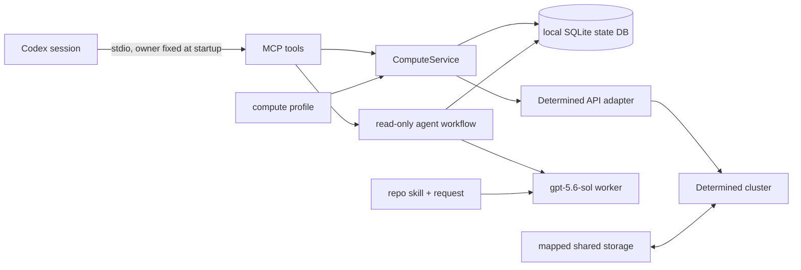

# Compute service guide

## Architecture

The service separates deterministic task control from optional agent advice:



`ComputeService` is the source of truth for task planning, idempotent launch, ownership checks, status, logs, cancellation, and conservative reconciliation. Its local `task_id` is stable across service restarts and is separate from any Determined `remote_id`. The SQLite file belongs on local durable storage; code, data, packages, checkpoints, logs, and outputs belong on mapped shared storage.

The MCP server is a local stdio service for one trusted user. It binds `owner` when the process starts, so tools cannot claim another namespace. Separate sessions can use separate owner names against one database; deliberate collaboration can share a name. This boundary helps organize tasks but does not provide multi-user security. An exposed or remote service needs a separate transport and authentication design.

The consultation workflow starts an isolated Codex worker configured for `gpt-5.6-sol`. The worker receives the user request and this repository's compute skill, has read-only responsibility, and persists its workflow state. Its advice does not launch or cancel work. Only deterministic tools mutate compute state.

## Profile

Load a profile with `ComputeProfile.from_file(path)`. The schema is:

```yaml
cluster_identity: optional-deployment-label
mounts:
  - host_path: /shared/path/on/agents
    container_path: /path/inside/container
defaults:
  image: verified-image
  pool: verified-pool
  slots: 1
shell_inactivity_seconds: 7200
```

Mount mappings are required. Image, pool, and slot values are deployment defaults and can be overridden by a request. `shell_inactivity_seconds` is optional and has no service default. The value is advisory; the service does not enforce shell idle timeouts.

## Request and mode selection

A request can contain:

| Field | Type | Purpose |
| --- | --- | --- |
| `kind` | `auto`, `command`, `shell`, `experiment` | Requested execution mode |
| `interactive` | boolean | Makes auto mode choose `shell` |
| `overnight` | boolean | Makes auto mode choose `experiment` |
| `command` | string or string list | Workload command |
| `workdir` | absolute container path | Working directory under a configured mount |
| `output_dir` | absolute container path | Output directory under a configured mount |
| `slots` | non-negative integer | Requested resource slots; zero is CPU-only if supported by the pool |
| `pool`, `image` | string | Optional profile-default overrides |
| `code_revision` | string | Revision/content identifier |
| `experiment_config` | object | Experiment-specific options |

Auto mode selects `shell` for interactive requests, `experiment` for overnight requests or those carrying `experiment_config`, and `command` otherwise. An explicit `kind` is preserved; for example, an overnight command remains a command and receives an experiment advisory. Use `command` for a one-off job expected to finish in a working session, `shell` for iterative debugging, and `experiment` for durable/overnight work or actual experiment features such as search, trial tracking, and checkpoint lifecycle.

`plan(request)` is offline and non-mutating. It returns the resolved `kind`, rendered `config`, `code_revision`, and `advisories`. Command and shell configs use `resources.slots`; experiments use `resources.slots_per_trial`. Planning must reject paths outside configured container mounts and source-upload fields. It does not authenticate, query the cluster, create projects, or launch work.

## Determined adapter behavior

The adapter exposes one `launch_task(kind, config)` boundary. Command and shell launches send the generated config mapping. Experiment launches serialize that config as YAML and request activation. The adapter rejects upload aliases including file contexts, project roots, and model definitions before transport; it never creates a project automatically. Responses are normalized to an entity with an `id`, with API envelopes removed. Configuration retained for identity reconciliation is sanitized: credential-like fields and environment-variable collections are redacted.

Command and shell cancellation use their task kill endpoint; experiment cancellation uses the experiment cancel endpoint. Command and shell logs come from the task log API. Experiment logs come from the highest numeric trial ID when trials exist. All log lists are returned oldest-to-newest for reading even though the API query asks for the latest records.

## Shared-storage preparation

Submissions carry path references only. Never populate an experiment `modelDefinition`, send a project archive, or use a project-root upload option. Place the complete runtime closure on mapped storage: source, configuration, data, locally supplied packages, checkpoints, logs, and expected artifacts.

Use a revision-specific directory for unattended work, for example:

```text
/workspace/<user>/compute/runs/<project>/<revision>/
  repo/
  results/
  checkpoints/
```

Set `workdir` and `output_dir` to the corresponding container paths and record `code_revision`. A mutable `/compute/debug/<project>` tree is appropriate for a shell. If directly syncing files, omit `--delete` and exclude `.env*`, `.secrets*`, credentials, tokens, caches, and project-specific secret files. The skill's [workflow reference](../skills/intensive-compute-runner/references/compute-workflow.md) contains a conservative template.

## MCP operation

Start a server with:

```bash
determined-compute-mcp \
  --profile /absolute/path/to/compute-profile.yaml \
  --db /absolute/local/path/to/compute.sqlite3 \
  --owner "$USER" \
  --repo-root /absolute/path/to/this/repository
```

Equivalent environment variables are `DETERMINED_COMPUTE_PROFILE`, `DETERMINED_COMPUTE_DB`, `DETERMINED_COMPUTE_OWNER`, and `DETERMINED_COMPUTE_REPO_ROOT`. The profile and database paths remain required in practice; keep credentials in the established Determined provider rather than these files.

The tools are:

| Tool | Arguments | Result |
| --- | --- | --- |
| `compute_plan` | `request` | Core plan object |
| `compute_launch` | `request`, `request_id` | Persisted task object |
| `compute_status` | `task_id` | Refreshed task object |
| `compute_logs` | `task_id`, optional `tail=200` | Core log result |
| `compute_cancel` | `task_id` | Updated task object |
| `compute_reconcile` | `task_id`, `remote_id` | Safely bind a verified uncertain submission |
| `compute_list_tasks` | none | Tasks in the startup-bound owner namespace |
| `compute_consult` | `question`, `request_id`, optional `context` | Persisted workflow object |
| `workflow_status` | `workflow_id` | Current persisted workflow object |

The owner is never a tool argument. On failure, MCP raises a tool error (`isError: true`) whose compact JSON content has the shape `{"error":{"code":"...","message":"...","retryable":false,"details":{...}}}`; `retryable` and `details` appear when available, and `structured_content` is null. Uncertain submission errors include their local task ID in details. Plan first, review resolved paths and advisories, and then launch with a stable request ID. Reusing that ID with identical content returns the established record; conflicting content is rejected.

For a running shell, use the adapter's sanitized `reconnectCommand`, currently `det shell show_ssh_command <remote-id>`. The adapter removes `privateKey` from returned shell entities; do not copy private key material into task records, MCP context, or reports.

## Failure and recovery rules

Transport, authentication, permission, and response-shape failures are errors, not empty results. Unknown capacity is reported as unknown rather than as zero free slots. Authentication failure never causes local fallback. Task log calls request the newest records from Determined and return them in chronological order; an experiment with no trials returns an empty list.

A network timeout during submission can leave acceptance uncertain. The service records that state and does not automatically resubmit, including after restart. MCP exposes `compute_reconcile(task_id, remote_id)` and the CLI exposes `determined-compute ... reconcile TASK_ID REMOTE_ID`. The core fetches that remote entity and binds it only when its unguessable submission marker matches the local record; a mismatch fails with `identity_mismatch`. Without verified evidence, investigate before any new launch.

Remote termination does not by itself prove success. Check exit information and the requested shared-storage artifacts or metrics before reporting completion. Reports may include sanitized commands, paths, task IDs, remote IDs, states, and errors; they must omit credential values and secret-file contents.

For consultation worker setup and crash recovery, see [agent-workflow.md](agent-workflow.md).
