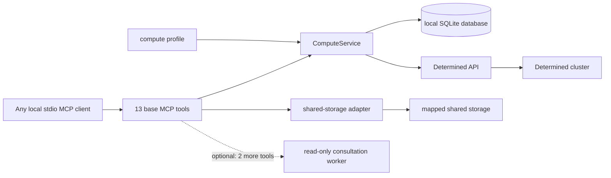

# 计算服务参考

[English](compute-service.md) | [简体中文](compute-service.zh.md)

本文说明本地 Determined 计算服务的配置和公开 MCP 接口。准备、提交和检查任务的通用 agent
流程见 [Agent 工作流](agent-workflow.zh.md)；可选的服务端建议 worker 见
[咨询后端](consultation.zh.md)。

<a id="architecture-and-trust-boundary"></a>
## 架构与信任边界



MCP server 是供一个可信用户使用的本地 stdio 服务。进程启动时绑定 `owner`，所有工具都不接受
owner 参数。多个进程可以在同一个数据库中使用不同 owner；需要协作时也可以有意共用 owner。
这只是命名空间边界，不是多用户认证。若要远程暴露服务，需要另行设计带认证的传输层。

`ComputeService` 负责规划、幂等提交、状态、日志、取消、发现、接管以及保守的调和。其本地
`task_id` 在服务重启后保持稳定，与 Determined 的 `remote_id` 不同。SQLite 数据库应放在
持久的本地存储上；源码、数据、包、检查点、日志和输出应放在映射的共享存储上。

咨询后端默认为 `none`。此模式注册 13 个基础工具，不导入咨询 worker，不要求安装 Codex，
也不要求存在仓库 skill 目录。启用 Codex 后端会增加 `compute_consult` 和 `workflow_status`，
总计 15 个工具。咨询只提供建议，不能提交或取消任务。

<a id="compute-profile"></a>
## 计算配置

通过 `--profile PATH` 或 `DETERMINED_COMPUTE_PROFILE` 传入配置。其结构如下：

```yaml
cluster_identity: optional-deployment-label
mounts:
  - host_path: /shared/projects
    container_path: /workspace
  - host_path: /shared/reference
    container_path: /reference
    read_only: true
defaults:
  image: your-image
  pool: your-pool
  slots: 1
shell_inactivity_seconds: 7200
```

至少需要一个挂载。`host_path` 是集群 agent 上的路径，不必存在于运行 MCP client 的机器上；
请求使用 `container_path`。容器根路径不能重叠，因此每个容器路径只通过一个对应挂载进行
映射。使用可能重叠的主机根路径验证 host-path 别名时，由最具体的根路径决定策略；匹配程度
相同时只读优先。`workdir`、`output_dir` 和显式检查点目标必须位于可写挂载下，仍可从只读
挂载读取参考数据。这些检查是服务策略，不能替代文件系统权限。

镜像、资源池和 slot 数量是请求可以覆盖的默认值。`slots` 必须是非负整数；若资源池支持，
零表示请求 CPU-only 的辅助容器容量。`shell_inactivity_seconds` 可省略，并且只作为提示；
服务本身不强制 shell 空闲超时。

`cluster_identity` 是可选的运维标签。服务把本地提交记录绑定到配置指纹、解析后的 Determined
端点和这个标签。改变该绑定后，不能再对这些记录执行状态、日志、取消或调和操作。

<a id="request-object-and-planning"></a>
## 请求对象与规划

`compute_plan` 和 `compute_launch` 接受相同的请求对象：

| 字段 | 类型 | 含义 |
| --- | --- | --- |
| `name` | 字符串 | 可选显示名称，最多 128 个字符 |
| `description` | 字符串或 null | 可选显示说明，最多 2,048 个字符 |
| `allow_queue` | 布尔值 | 当前容量不足时允许排队；默认 `false` |
| `kind` | `auto`、`command`、`shell` 或 `experiment` | 执行模式；默认 `auto` |
| `interactive` | 布尔值 | 要求 shell 模式；在 auto 模式下选择 `shell` |
| `overnight` | 布尔值 | 在 auto 模式下选择 `experiment` |
| `command` | 字符串或字符串数组 | command 或 experiment 的入口；shell 模式拒绝此字段 |
| `workdir` | 容器绝对路径 | 可写已配置挂载下的工作目录 |
| `output_dir` | 容器绝对路径 | 可写已配置挂载下的输出目录 |
| `slots` | 非负整数 | 请求的 slot 数；默认使用配置值 |
| `pool`、`image` | 字符串 | 可选的配置默认值覆盖 |
| `code_revision` | 字符串或 null | 调用方提供的版本或内容标识 |
| `experiment_config` | 对象 | 额外的实验配置；要求 experiment 模式 |

服务拒绝未知字段以及上传/context 字段。在 auto 模式中，`interactive` 优先选择 `shell`，
其次由 `overnight` 或 `experiment_config` 选择 `experiment`，其余请求选择 `command`。
显式 `kind` 会保留，所以 overnight command 仍是 command，并收到一条提示。

规划完全离线，不做认证、容量检查、项目创建或任务提交。它返回 `kind`、`name`、
`description`、`allow_queue`、渲染后的 `config`、`code_revision` 和 `advisories`。省略
`name` 时，服务会生成名称并添加提示。command 和 shell 把名称放在 description 第一行；
experiment 使用原生 name 字段。顶层显示元数据会覆盖同名的 experiment 字段。

command 和 experiment 的入口先创建 `output_dir`，再切换到 `workdir`，最后通过
`/bin/bash -lc` 运行命令。command 和 shell 配置使用 `resources.slots`，experiment 使用
`resources.slots_per_trial`。服务提供配置中的 bind mount，并管理 `COMPUTE_WORKDIR`、
`COMPUTE_OUTPUT_DIR`、`COMPUTE_CODE_REVISION` 和私有提交标记；请求不能覆盖这些环境变量或
bind mount。

experiment 必须提供 `command` 或 `experiment_config.entrypoint`，但不能同时提供。显式
`checkpoint_storage` 必须使用 `type: shared_fs`、可写的映射 `host_path`，且可选的
`storage_path` 必须留在该 host path 内。服务拒绝旧的 `checkpoint_path` 和
`tensorboard_path` 别名。若省略 checkpoint storage，Determined 使用集群默认配置，离线规划
无法检查该默认值。

<a id="start-the-mcp-server"></a>
## 启动 MCP server

为每个已配置的 client 启动一个持久 stdio 进程：

```bash
determined-compute-mcp \
  --profile /absolute/path/to/compute-profile.yaml \
  --db /absolute/local/path/to/tasks.sqlite3 \
  --owner your-owner \
  --secrets-file /absolute/path/to/credentials.env \
  --verify-ssl
```

`--profile`、`--db` 和 `--owner` 分别对应 `DETERMINED_COMPUTE_PROFILE`、
`DETERMINED_COMPUTE_DB` 和 `DETERMINED_COMPUTE_OWNER`；`--storage-config` 对应
`DETERMINED_COMPUTE_STORAGE`；`--secrets-file` 也可通过 `DETERMINED_COMPUTE_SECRETS`
提供。API URL、token 和 TLS 验证默认来自 `DET_MASTER`、`DET_API_TOKEN` 和
`DET_VERIFY_SSL`。凭据应放在现有凭据提供方或 secrets 文件中，不要写入配置、数据库、工具
参数或报告。

CLI 的默认数据库路径是 `~/.local/state/determined-compute/tasks.sqlite3`，但 MCP 部署应显式
指定本地绝对路径。MCP 拒绝 `:memory:`。服务升级后，应重启共用该数据库的所有 MCP 进程，
使它们加载同一套工具和新增式 schema。

客户端访问映射共享存储的可选功能使用同一计算配置和独立的存储配置。参见
[共享存储访问](shared-storage-access.zh.md)。

<a id="mcp-api"></a>
## MCP API

基础 server 提供 13 个工具。下文的 `owner` 始终指启动时绑定的命名空间，不是工具参数。

| 工具 | 参数 | 返回值与作用 |
| --- | --- | --- |
| `compute_plan` | `request` | 离线规范化的规划；不访问集群或修改数据库 |
| `compute_launch` | `request`、`request_id` | 持久化任务记录；最多提交一次 |
| `compute_status` | `task_id` | 本地任务记录、刷新后的远端状态，以及绑定后取得的远端实体 |
| `compute_logs` | `task_id`，可选 `tail=200` | 最新远端日志按时间正序排列的列表 |
| `compute_cancel` | `task_id` | 更新后的记录、远端取消响应与确认标志 |
| `compute_reconcile` | `task_id`、`remote_id` | 仅在验证标记后绑定的记录 |
| `compute_list_tasks` | 无 | 已绑定 owner 命名空间内的本地记录 |
| `compute_discover` | `kind`，可选 `limit=50`、`offset=0` | 当前账户的一页远端任务；不修改本地状态 |
| `compute_adopt` | `kind`、`remote_id` | 幂等注册的本地记录；不提交远端任务 |
| `compute_resources` | 可选 `slots=1`、`pool` | 当前调度容量和候选资源池 |
| `storage_check` | `path` | 映射容器路径的访问情况 |
| `storage_sync` | `local_dir`、`shared_dir`，可选 `dry_run=true` | 预览或把本地目录内容复制到共享存储 |
| `storage_fetch` | `shared_dir`、`local_dir`，可选 `dry_run=true` | 预览或把共享目录内容复制到本地 |

只有启用咨询后端时才会出现 `compute_consult(question, request_id, context?)` 和
`workflow_status(workflow_id)`。其配置、生命周期和限制见[咨询后端](consultation.zh.md)。

<a id="plan-capacity-and-launch"></a>
### 规划、容量与提交

先调用 `compute_plan`，检查解析后的路径、模式、镜像、资源池、slot 和提示。
`compute_resources` 返回实时快照，不保留资源。正 slot 数检查可调度的 agent slot；零检查辅助
容器容量。候选资源池只是建议，服务不会自动替换。

除非显式设置 `allow_queue: true`，`compute_launch` 会先检查容量。`request_id` 是已绑定 owner
内的幂等键。用相同 ID 和等价请求重试会返回已有记录；用不同内容复用会返回
`idempotency_conflict`。本地记录一旦认领该 ID，即使服务重启，重试也不会提交第二个远端
任务。

适配器把 command 和 shell 配置作为 mapping 发送；experiment 配置会序列化为 YAML 并请求
激活。适配器拒绝源码上传别名，从不自动创建项目，会移除 API envelope、清理用于身份调和的
材料，并返回含 `id` 的实体。

<a id="task-records-status-logs-and-cancellation"></a>
### 任务记录、状态、日志与取消

公开任务记录包含 `task_id`、`request_id`、`owner`、`origin`、`kind`、本地 `state`、
`remote_id`、`remote_state`、显示元数据、路径、版本、集群/账户绑定字段、可选的固定
`error_code` 和时间戳。内部请求 hash、配置 hash 和提交标记不会公开。服务不会在任务记录中
保存完整请求、生成的配置、API 响应、日志或原始异常文本。

未绑定 remote ID 时，`compute_status` 只返回本地状态，不访问 Determined；绑定后会取得远端
实体、更新 `remote_state`，并在 `remote` 中包含清理后的实体。过期的 `pending` 或
`submitting` 记录会变为 `submission_uncertain`，但不会触发自动重提。

`compute_logs` 要求 `tail` 为正数。command 和 shell 日志来自相应 task log API；experiment
日志来自数值最大的 trial ID，没有 trial 时返回空列表。结果按从旧到新排列。没有 remote ID
的任务也返回空列表。

`compute_cancel` 对 command 和 shell 使用 task kill endpoint，对 experiment 使用 experiment
cancel endpoint。它要求任务已绑定 remote ID；API 调用完成后返回
`cancellation_acknowledged: true`。远端终止并不能单独证明成功，还应检查退出信息和预期的
共享存储产物。

对于正在运行的 shell，应使用已清理的 `reconnectCommand`，当前为
`det shell show_ssh_command <remote-id>`。适配器会移除 `privateKey`；不要把私钥材料写入任务
记录、咨询 context 或报告。

<a id="discover-and-adopt"></a>
### 发现与接管

`compute_discover` 的 `kind` 可以是 `command`、`shell` 或 `experiment`。`limit` 必须在
1 到 100 之间，`offset` 必须是非负数。它只查询当前已认证 Determined 账户拥有的任务，返回
实际集群 ID、账户身份、清理后的元数据、匹配的 `local_task_id`（若有）以及包含
`next_offset` 的一致分页信息。它既不写入本地记录，也不提交任务。
command 和 shell 的 remote ID 是 UUID，experiment 的 remote ID 是正整数。

`compute_adopt` 先取得一个远端任务，再把其规范化 ID 和 `userId` 与 `/me` 对照，验证通过后
才写入。即使管理员可以看到其他任务，也不能接管其他用户的任务。注册身份由本地 owner、实际
集群 ID、kind 和 remote ID 组成；记录还会绑定并验证已认证的用户 ID。同一数据库中已有的
submitted 记录会原样返回，不会被替换。

新接管记录使用 `origin: "adopted"`、本地 `state: "adopted"` 和内部接管 request ID。记录只
保留白名单中的身份、状态、名称和说明元数据。未知的 `workdir`、`output_dir` 和
`code_revision` 对外为 `null`；存储层不会推断这些值，也不保留原始远端配置。后续状态、日志
和取消操作会再次检查实际集群和账户绑定。接管任务不把提交时配置作为授权依据，也不会获得
任何存储权限。

对于通过 WebUI、原生 CLI 或同一账户的另一设备创建的工作，使用发现和接管；对于远端是否
接受某次本地提交并不确定的情况，使用调和。adopted 任务不能调和，也不能作为 launch 重试。

<a id="reconciliation-and-recovery"></a>
### 调和与恢复

传输超时可能导致远端是否接受提交未知。服务会保留本地任务，并在错误 details 中返回其
`task_id`，不会自动重提该请求。`compute_reconcile(task_id, remote_id)` 会取得候选实体，仅当
其保留的 `COMPUTE_SUBMISSION_MARKER` 等于本地不可猜测标记时才绑定；不匹配会返回
`identity_mismatch`。只有缺少已存显示元数据的迁移旧记录才会使用 description 第一行标记。

该标记把调和与接管隔离开：有匹配标记的不确定本地提交必须调和，独立创建的远端任务才可以
接管。缺少证据时应继续调查，不要再次提交同一工作。

本地 submitted 任务始终绑定原始配置指纹和端点；adopted 任务始终绑定实际集群 ID 和已认证
用户 ID。这些检查避免改变配置或账户后操作无关任务。

<a id="errors"></a>
### 错误

MCP 失败使用 `isError: true`；其文本内容是如下形式的紧凑 JSON：

```json
{"error":{"code":"invalid_request","message":"...","retryable":false,"details":{}}}
```

`retryable` 和 `details` 仅在可用时出现，structured content 为 null。安全 details 可包含本地
task ID 和容量信息。认证、权限、传输和响应结构错误都会返回错误，而不是空结果。错误消息和
报告可以包含清理后的命令、路径、ID、状态和错误类别，但不能包含凭据或 secrets 文件内容。

<a id="cli-equivalents"></a>
## CLI 等价命令

JSON CLI 使用相同的服务边界，并可与 MCP 共用数据库和 owner。请求可以以内联 JSON/YAML 或
文件提供；成功结果包装为 `{"ok":true,"result":...}`，失败包装为
`{"ok":false,"error":...}`。以下是完整的短配置；请把 `TASK_ID` 和 `REMOTE_ID` 替换为实际
返回的标识：

```bash
export DETERMINED_COMPUTE_PROFILE="$PWD/.local/profile.yaml"
export DETERMINED_COMPUTE_DB="$PWD/.local/tasks.sqlite3"
export DETERMINED_COMPUTE_OWNER="$USER"
export DETERMINED_COMPUTE_SECRETS="$PWD/.local/credentials.env"
export DET_VERIFY_SSL=true

determined-compute plan --request-file .local/request.json
determined-compute launch --request-file .local/request.json --request-id my-job-001
determined-compute status TASK_ID
determined-compute logs TASK_ID

determined-compute discover command --limit 20 --offset 0
determined-compute adopt command REMOTE_ID
```

文件暂存与取回见[共享存储指南](shared-storage-access.zh.md)。围绕这些确定性调用的完整 agent
流程见 [Agent 工作流](agent-workflow.zh.md)。
